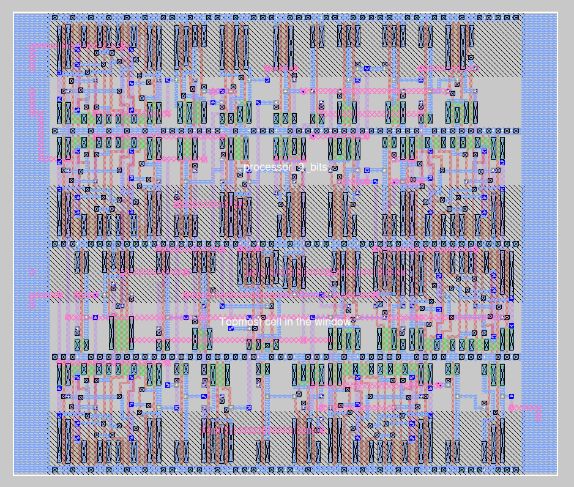

<h1>9-Bit Microprocessor Design Using Qflow</h1>
This project demonstrates an example of the VLSI flow used to synthesize a 9-bit microprocessor,
Made by the open-source tool Qflow. The tool takes the processor's Verilog RTL (Register-Transfer Level) code and,
through a series of automated steps, generates a GDSII file that is ready for fabrication at a chip manufacturing facility (Fab lab).

<h2>Objective</h2>
The goal of this project is to illustrate the complete VLSI design flow, starting from a high-level Verilog description of a 9-bit microprocessor
and culminating in the generation of a GDSII file, which represents the physical layout of the chip.

<h2>What is VLSI Flow?</h2>
VLSI (Very Large Scale Integration) flow refers to the process of converting an RTL design into a physical layout that can be manufactured.
It involves multiple steps, such as synthesis, placement, routing, and design rule verification.

<h2>Qflow ?</h2>
So Qflow is an open-source toolchain specifically designed for digital VLSI design, and regroupe the following tools 

yosys: RTL synthesis.
GrayWolf: Placement.
Qrouter: Routing.
Magic: Physical layout generation and verification.
Netgen: Layout vs. schematic (LVS) checks.

the following image represente the final results of the flow , it's a physical layout.

The processor consists of 32 cells, ranging from NAND gates to simple inverters, all packed into a compact surface area of 11.448 µm²,
This efficient design achieves a clock frequency of up to 655.5 MHz, 
